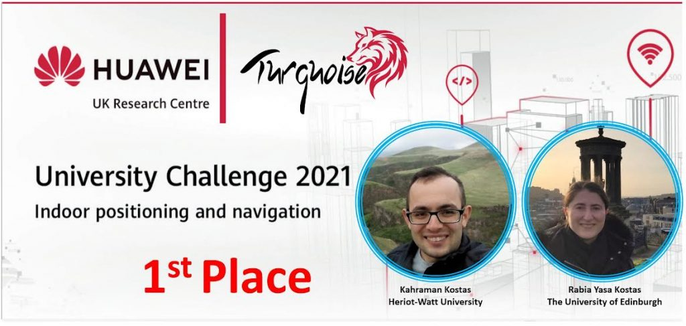
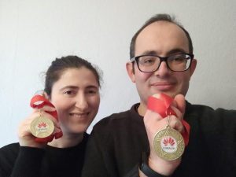

## Turkish Students win Huawei UK University Challenge Competition 2021.

TWO Turkish students doing a PhD in computer science in the UK won the Huawei UK University Challenge Competition 2021.

Kahraman Koştaş studying at the Heriot Watt University along with Rabia Yaşa Koştaş who is enrolled at The University of Edinburgh, are in the UK part of the scholarship program organised by the Republic of Turkey to study abroad for postgraduate studies.

The PhD students won the top prize in the annual event organised by Huawei UK Research Centre. The group were given two tasks to find a solutions looking at artificial intelligence, with fingerprint and WIFI technology.  Their solution won out of hundred of applications, earning them the top prize of £7,000 as well as Huawei equipment and medals.

Speaking to Londra Gazete they said “We came first in the Huawei UK University Challenge Competition 2021, organized by Huawei company across the UK. Our team’s name was Turquoise. Many UK universities participated in this competition at all levels (275 students and 150+ teams).

“As a result of this competition, our group was awarded the first place with a gold medal, certificate and financial awards (2 matepad pro tablet computer and £7000).

“The concept of the competition was the solution of indoor positioning problems using data science (Data Science for Indoor positioning). For those who are unfamiliar with the subject, a more comprehensive and simple recipe can be called “coding competition with artificial intelligence”. Such competitions are very important in terms of enabling the theoretical knowledge taught at the university to be applied to real life problems and bringing academia and industry together.”

