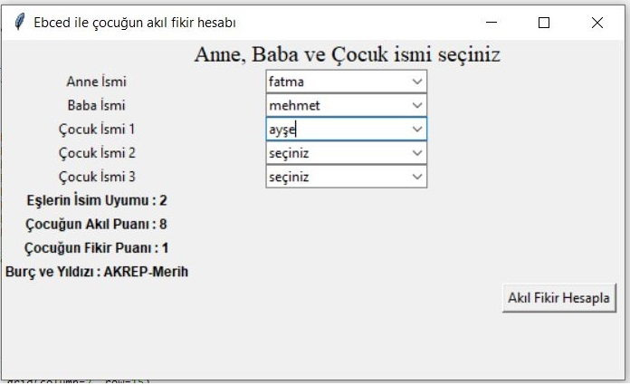

# Ebced ile Akıl Fikir Hesaplama

Eskiden çocuklara isim seçmede izlenen yollardan bir tanesi de [ebced](https://tr.wikipedia.org/wiki/Ebced_hesab%C4%B1) ile ismin akıl ve fikir değerlerini hesaplayarak, en iyi-yüksek değeri vermekti. Bu bağlamda, seçtiğiniz isimlerin akıl ve fikir değerlerini hesaplayan basit bir program yazdım.
Bu tarz yöntemleri muteber bulmuyorum ancak kafanızda çok fazla potansiyel isim varsa elemenize faydası dokunacaktır. Ayrıca kodlaması eğlenceliydi.

**AKIL**: 1 ile 9 arasında bir değer alır. En yuksek 9 dur. Anne ve çocuk isimlerin ebced değerine göre hesaplanır.

**FİKİR**:  1 ile 9 arasında bir değer alır. En yuksek 9 dur. Baba ve çocuk isimlerin ebced değerine göre hesaplanır.

**Eşlerin İsim Uyumu**: 1 ile 9 arasında bir değer alır. En yuksek 9 dur. Çocuğa verilebilecek en ez ve en fazla akıl-fikir değerini  etkiler. 

**Burç ve Yıldız**: 1 ile 12 arasinda bir deger alır.ı Anne ve cocuk isimlerin ebced değerine göre hesaplanır. Burada yer alan burçlar,  astronomi tabanlı burçlar değildir. 

|Kalan|Burç|Yıldız|
| ------ | ------ | ------ |
|1.	|	KOÇ	|	Merih|
|2.	|	BOĞA	|	Zühre|
|3.		|İKİZLER	|	Utarid|
|4.	|	YENGEÇ	|	Ay|
|5.	|	ASLAN	|	Güneş|
|6.	|	BAŞAK		|Utarid|
|7.	|	TERAZİ	|	Zühre|
|8.	|	AKREP		|Merih|
|9.	|	YAY		|Müşteri|
|10.|		OĞLAK		|Zühal|
|11.	|	KOVA		|Zühal|
|12.	|	BALIK		|Müşteri|

isimleri ve ebced değerlerini [isimler ve ebced değerleri](https://github.com/kahramankostas/isimler-ve-ebced-de-erleri) çalışmasında oluşturduğumuz küçük verisetinden alır. Bu yüzden eksik/yanlış isimler olabilir. Kontrol etmekten çekinmeyin.

